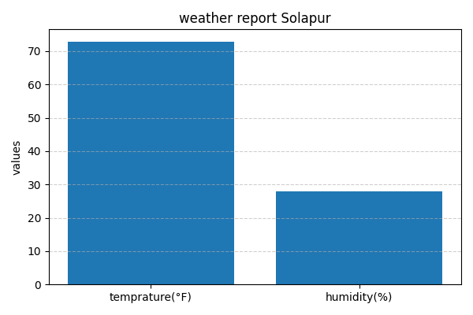

Weather Dashboard using Python 🌦️

## 📌 Project Overview
This project fetches real-time weather data from a public API and visualizes it using Python.  
The user enters a city name, and the application displays the current temperature, humidity, and weather condition along with a bar chart visualization.

This project was developed as **Task 1** for the **CodeTech Python Programming Internship**.

---

## 🛠️ Technologies Used
- Python 3
- OpenWeatherMap API
- Requests library
- Matplotlib

---

## 🔗 API Used
- **OpenWeatherMap API**
- Data fetched: Temperature, Humidity, Weather condition

---

## ⚙️ How It Works
1. User enters the city name.
2. Python sends a request to the OpenWeatherMap API.
3. The API responds with weather data in JSON format.
4. Required data is extracted and displayed in the console.
5. A bar chart visualizing temperature and humidity is generated and saved as an image.

---

## 📊 Output
The program generates:
- Console output with weather details
- A bar chart showing temperature and humidity

📷 **Sample Output:**



---

## ▶️ How to Run the Project
1. Clone this repository
2. Create and activate a virtual environment
3. Install required libraries:
   ```bash
   pip install requests matplotlib
